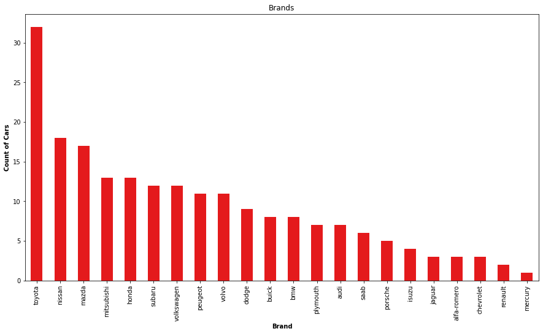
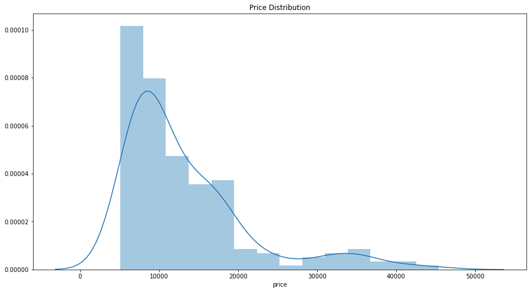
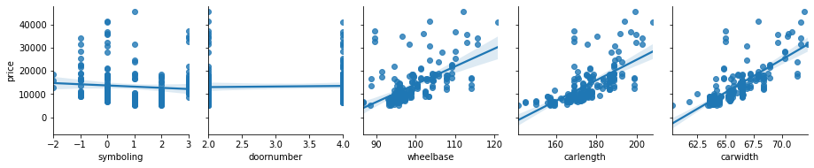
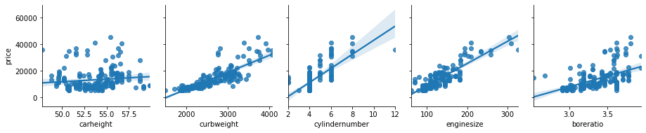
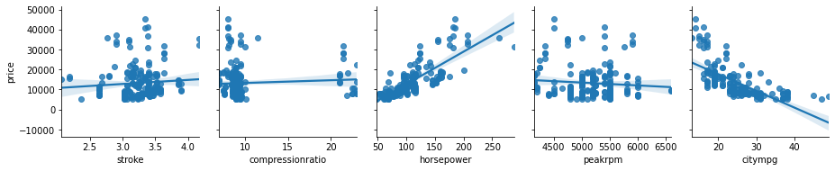
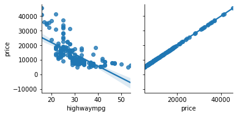
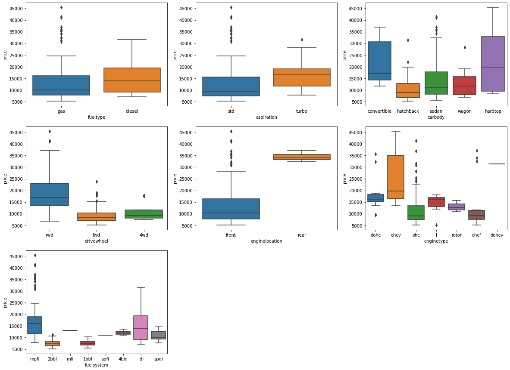

## Import Data


```python
import os
import numpy as np
import pandas as pd
```


```python
data_path = os.path.join('datasets', 'CarPrice_Assignment.csv')
cars = pd.read_csv(data_path)
```


```python
cars.head()
```


<div>
<table border="1" class="dataframe">
  <thead>
    <tr style="text-align: right;">
      <th></th>
      <th>car_ID</th>
      <th>symboling</th>
      <th>CarName</th>
      <th>fueltype</th>
      <th>aspiration</th>
      <th>doornumber</th>
      <th>carbody</th>
      <th>drivewheel</th>
      <th>enginelocation</th>
      <th>wheelbase</th>
      <th>...</th>
      <th>enginesize</th>
      <th>fuelsystem</th>
      <th>boreratio</th>
      <th>stroke</th>
      <th>compressionratio</th>
      <th>horsepower</th>
      <th>peakrpm</th>
      <th>citympg</th>
      <th>highwaympg</th>
      <th>price</th>
    </tr>
  </thead>
  <tbody>
    <tr>
      <th>0</th>
      <td>1</td>
      <td>3</td>
      <td>alfa-romero giulia</td>
      <td>gas</td>
      <td>std</td>
      <td>two</td>
      <td>convertible</td>
      <td>rwd</td>
      <td>front</td>
      <td>88.6</td>
      <td>...</td>
      <td>130</td>
      <td>mpfi</td>
      <td>3.47</td>
      <td>2.68</td>
      <td>9.0</td>
      <td>111</td>
      <td>5000</td>
      <td>21</td>
      <td>27</td>
      <td>13495.0</td>
    </tr>
    <tr>
      <th>1</th>
      <td>2</td>
      <td>3</td>
      <td>alfa-romero stelvio</td>
      <td>gas</td>
      <td>std</td>
      <td>two</td>
      <td>convertible</td>
      <td>rwd</td>
      <td>front</td>
      <td>88.6</td>
      <td>...</td>
      <td>130</td>
      <td>mpfi</td>
      <td>3.47</td>
      <td>2.68</td>
      <td>9.0</td>
      <td>111</td>
      <td>5000</td>
      <td>21</td>
      <td>27</td>
      <td>16500.0</td>
    </tr>
    <tr>
      <th>2</th>
      <td>3</td>
      <td>1</td>
      <td>alfa-romero Quadrifoglio</td>
      <td>gas</td>
      <td>std</td>
      <td>two</td>
      <td>hatchback</td>
      <td>rwd</td>
      <td>front</td>
      <td>94.5</td>
      <td>...</td>
      <td>152</td>
      <td>mpfi</td>
      <td>2.68</td>
      <td>3.47</td>
      <td>9.0</td>
      <td>154</td>
      <td>5000</td>
      <td>19</td>
      <td>26</td>
      <td>16500.0</td>
    </tr>
    <tr>
      <th>3</th>
      <td>4</td>
      <td>2</td>
      <td>audi 100 ls</td>
      <td>gas</td>
      <td>std</td>
      <td>four</td>
      <td>sedan</td>
      <td>fwd</td>
      <td>front</td>
      <td>99.8</td>
      <td>...</td>
      <td>109</td>
      <td>mpfi</td>
      <td>3.19</td>
      <td>3.40</td>
      <td>10.0</td>
      <td>102</td>
      <td>5500</td>
      <td>24</td>
      <td>30</td>
      <td>13950.0</td>
    </tr>
    <tr>
      <th>4</th>
      <td>5</td>
      <td>2</td>
      <td>audi 100ls</td>
      <td>gas</td>
      <td>std</td>
      <td>four</td>
      <td>sedan</td>
      <td>4wd</td>
      <td>front</td>
      <td>99.4</td>
      <td>...</td>
      <td>136</td>
      <td>mpfi</td>
      <td>3.19</td>
      <td>3.40</td>
      <td>8.0</td>
      <td>115</td>
      <td>5500</td>
      <td>18</td>
      <td>22</td>
      <td>17450.0</td>
    </tr>
  </tbody>
</table>
<p>5 rows × 26 columns</p>
</div>


```python
cars.info()
```

    <class 'pandas.core.frame.DataFrame'>
    RangeIndex: 205 entries, 0 to 204
    Data columns (total 26 columns):
     #   Column            Non-Null Count  Dtype  
    ---  ------            --------------  -----  
     0   car_ID            205 non-null    int64  
     1   symboling         205 non-null    int64  
     2   CarName           205 non-null    object 
     3   fueltype          205 non-null    object 
     4   aspiration        205 non-null    object 
     5   doornumber        205 non-null    object 
     6   carbody           205 non-null    object 
     7   drivewheel        205 non-null    object 
     8   enginelocation    205 non-null    object 
     9   wheelbase         205 non-null    float64
     10  carlength         205 non-null    float64
     11  carwidth          205 non-null    float64
     12  carheight         205 non-null    float64
     13  curbweight        205 non-null    int64  
     14  enginetype        205 non-null    object 
     15  cylindernumber    205 non-null    object 
     16  enginesize        205 non-null    int64  
     17  fuelsystem        205 non-null    object 
     18  boreratio         205 non-null    float64
     19  stroke            205 non-null    float64
     20  compressionratio  205 non-null    float64
     21  horsepower        205 non-null    int64  
     22  peakrpm           205 non-null    int64  
     23  citympg           205 non-null    int64  
     24  highwaympg        205 non-null    int64  
     25  price             205 non-null    float64
    dtypes: float64(8), int64(8), object(10)
    memory usage: 41.8+ KB
    


```python
cars.describe()
```


<div>
<table border="1" class="dataframe">
  <thead>
    <tr style="text-align: right;">
      <th></th>
      <th>car_ID</th>
      <th>symboling</th>
      <th>wheelbase</th>
      <th>carlength</th>
      <th>carwidth</th>
      <th>carheight</th>
      <th>curbweight</th>
      <th>enginesize</th>
      <th>boreratio</th>
      <th>stroke</th>
      <th>compressionratio</th>
      <th>horsepower</th>
      <th>peakrpm</th>
      <th>citympg</th>
      <th>highwaympg</th>
      <th>price</th>
    </tr>
  </thead>
  <tbody>
    <tr>
      <th>count</th>
      <td>205.000000</td>
      <td>205.000000</td>
      <td>205.000000</td>
      <td>205.000000</td>
      <td>205.000000</td>
      <td>205.000000</td>
      <td>205.000000</td>
      <td>205.000000</td>
      <td>205.000000</td>
      <td>205.000000</td>
      <td>205.000000</td>
      <td>205.000000</td>
      <td>205.000000</td>
      <td>205.000000</td>
      <td>205.000000</td>
      <td>205.000000</td>
    </tr>
    <tr>
      <th>mean</th>
      <td>103.000000</td>
      <td>0.834146</td>
      <td>98.756585</td>
      <td>174.049268</td>
      <td>65.907805</td>
      <td>53.724878</td>
      <td>2555.565854</td>
      <td>126.907317</td>
      <td>3.329756</td>
      <td>3.255415</td>
      <td>10.142537</td>
      <td>104.117073</td>
      <td>5125.121951</td>
      <td>25.219512</td>
      <td>30.751220</td>
      <td>13276.710571</td>
    </tr>
    <tr>
      <th>std</th>
      <td>59.322565</td>
      <td>1.245307</td>
      <td>6.021776</td>
      <td>12.337289</td>
      <td>2.145204</td>
      <td>2.443522</td>
      <td>520.680204</td>
      <td>41.642693</td>
      <td>0.270844</td>
      <td>0.313597</td>
      <td>3.972040</td>
      <td>39.544167</td>
      <td>476.985643</td>
      <td>6.542142</td>
      <td>6.886443</td>
      <td>7988.852332</td>
    </tr>
    <tr>
      <th>min</th>
      <td>1.000000</td>
      <td>-2.000000</td>
      <td>86.600000</td>
      <td>141.100000</td>
      <td>60.300000</td>
      <td>47.800000</td>
      <td>1488.000000</td>
      <td>61.000000</td>
      <td>2.540000</td>
      <td>2.070000</td>
      <td>7.000000</td>
      <td>48.000000</td>
      <td>4150.000000</td>
      <td>13.000000</td>
      <td>16.000000</td>
      <td>5118.000000</td>
    </tr>
    <tr>
      <th>25%</th>
      <td>52.000000</td>
      <td>0.000000</td>
      <td>94.500000</td>
      <td>166.300000</td>
      <td>64.100000</td>
      <td>52.000000</td>
      <td>2145.000000</td>
      <td>97.000000</td>
      <td>3.150000</td>
      <td>3.110000</td>
      <td>8.600000</td>
      <td>70.000000</td>
      <td>4800.000000</td>
      <td>19.000000</td>
      <td>25.000000</td>
      <td>7788.000000</td>
    </tr>
    <tr>
      <th>50%</th>
      <td>103.000000</td>
      <td>1.000000</td>
      <td>97.000000</td>
      <td>173.200000</td>
      <td>65.500000</td>
      <td>54.100000</td>
      <td>2414.000000</td>
      <td>120.000000</td>
      <td>3.310000</td>
      <td>3.290000</td>
      <td>9.000000</td>
      <td>95.000000</td>
      <td>5200.000000</td>
      <td>24.000000</td>
      <td>30.000000</td>
      <td>10295.000000</td>
    </tr>
    <tr>
      <th>75%</th>
      <td>154.000000</td>
      <td>2.000000</td>
      <td>102.400000</td>
      <td>183.100000</td>
      <td>66.900000</td>
      <td>55.500000</td>
      <td>2935.000000</td>
      <td>141.000000</td>
      <td>3.580000</td>
      <td>3.410000</td>
      <td>9.400000</td>
      <td>116.000000</td>
      <td>5500.000000</td>
      <td>30.000000</td>
      <td>34.000000</td>
      <td>16503.000000</td>
    </tr>
    <tr>
      <th>max</th>
      <td>205.000000</td>
      <td>3.000000</td>
      <td>120.900000</td>
      <td>208.100000</td>
      <td>72.300000</td>
      <td>59.800000</td>
      <td>4066.000000</td>
      <td>326.000000</td>
      <td>3.940000</td>
      <td>4.170000</td>
      <td>23.000000</td>
      <td>288.000000</td>
      <td>6600.000000</td>
      <td>49.000000</td>
      <td>54.000000</td>
      <td>45400.000000</td>
    </tr>
  </tbody>
</table>
</div>


It seems that we have no null value

## Data Cleaning


```python
import matplotlib.pyplot as plt
import seaborn as sns
```


```python
cars = cars.drop('car_ID', axis=1)
```


```python
cars['CarName'] = cars['CarName'].str.split(' ', expand=True)
```


```python
cars['CarName'].unique()
```


    array(['alfa-romero', 'audi', 'bmw', 'chevrolet', 'dodge', 'honda',
           'isuzu', 'jaguar', 'maxda', 'mazda', 'buick', 'mercury',
           'mitsubishi', 'Nissan', 'nissan', 'peugeot', 'plymouth', 'porsche',
           'porcshce', 'renault', 'saab', 'subaru', 'toyota', 'toyouta',
           'vokswagen', 'volkswagen', 'vw', 'volvo'], dtype=object)


```python
cars['CarName'] = cars['CarName'].replace({'maxda': 'mazda',
                                           'Nissan': 'nissan',
                                           'porcshce': 'porsche',
                                           'vokswagen': 'volkswagen',
                                           'vw': 'volkswagen',
                                           'toyouta': 'toyota'
                                          })
```


```python
cars['doornumber'].unique()
```


    array(['two', 'four'], dtype=object)


```python
cars['doornumber'] = cars['doornumber'].replace({'two': 2, 'four': 4})
```


```python
cars['cylindernumber'].unique()
```


    array(['four', 'six', 'five', 'three', 'twelve', 'two', 'eight'],
          dtype=object)


```python
cars['cylindernumber'] = cars['cylindernumber'].replace({'four': 4,
                                                         'six': 6,
                                                         'five': 5,
                                                         'three': 3,
                                                         'twelve': 12,
                                                         'two': 2,
                                                         'eight': 8
                                                        })
```


```python
cat_col = cars.select_dtypes(include=['object']).columns
num_col = cars.select_dtypes(exclude=['object']).columns
```

## Data Visualization


```python
plt.rcParams['figure.figsize'] = [15, 8]
ax = cars['CarName'].value_counts().plot(kind='bar', stacked=True, colormap='Set1')
ax.title.set_text('Brands')
plt.xlabel('Brand', fontweight='bold')
plt.ylabel('Count of Cars', fontweight='bold')
```


    Text(0, 0.5, 'Count of Cars')





```python
plt.figure(figsize=(15,8))
plt.title('Price Distribution')
sns.distplot(cars['price'])
```


    <matplotlib.axes._subplots.AxesSubplot at 0x11aafd1c988>





### Visualising Numeric Variables


```python
for i in range(0,4):
    batch=5*i
    sns.pairplot(
        data=cars,
        y_vars=['price'],
        x_vars=num_col[0+batch:5+batch],
        kind="reg"
    )
```














```python
corr = cars[num_col].corr()
corr['price'].sort_values(ascending=False)
```


    price               1.000000
    enginesize          0.874145
    curbweight          0.835305
    horsepower          0.808139
    carwidth            0.759325
    cylindernumber      0.718305
    carlength           0.682920
    wheelbase           0.577816
    boreratio           0.553173
    carheight           0.119336
    stroke              0.079443
    compressionratio    0.067984
    doornumber          0.031835
    symboling          -0.079978
    peakrpm            -0.085267
    citympg            -0.685751
    highwaympg         -0.697599
    Name: price, dtype: float64


- Relevant positive correlation: 
    - enginesize 
    - curbweight 
    - horsepower 
    - carwidth 
    - cylindernumber 
    - carlength
    - wheelbase
    - boreratio
    
- Relevant negative correlation: 
    - citympg
    - highwaympg


```python
num_col_rel = ['enginesize', 'curbweight', 'horsepower', 'carwidth', 'cylindernumber', 'carlength', 'wheelbase', 'boreratio', 'price']
num_col_rel
```


    ['enginesize',
     'curbweight',
     'horsepower',
     'carwidth',
     'cylindernumber',
     'carlength',
     'wheelbase',
     'boreratio',
     'price']


### Visualising Categorical Variables


```python
plt.figure(figsize=(20,15))

for i in range(1, len(cat_col)):
    plt.subplot(3,3,i)
    sns.boxplot(data=cars, x=cat_col[i], y='price')
    
plt.show()
```





All the categorical variables impact on the price


```python
num_col_rel.extend(cat_col)
columns = num_col_rel
columns
```


    ['enginesize',
     'curbweight',
     'horsepower',
     'carwidth',
     'cylindernumber',
     'carlength',
     'wheelbase',
     'boreratio',
     'price',
     'CarName',
     'fueltype',
     'aspiration',
     'carbody',
     'drivewheel',
     'enginelocation',
     'enginetype',
     'fuelsystem']


```python
cars = cars[columns]
```

## Create Sets


```python
from sklearn.model_selection import train_test_split
```


```python
train_set, test_set = train_test_split(cars, test_size=0.2, random_state=42)
```

## Prepare Data


```python
train_set.head()
```


<div>
<table border="1" class="dataframe">
  <thead>
    <tr style="text-align: right;">
      <th></th>
      <th>enginesize</th>
      <th>curbweight</th>
      <th>horsepower</th>
      <th>carwidth</th>
      <th>cylindernumber</th>
      <th>carlength</th>
      <th>wheelbase</th>
      <th>boreratio</th>
      <th>price</th>
      <th>CarName</th>
      <th>fueltype</th>
      <th>aspiration</th>
      <th>carbody</th>
      <th>drivewheel</th>
      <th>enginelocation</th>
      <th>enginetype</th>
      <th>fuelsystem</th>
    </tr>
  </thead>
  <tbody>
    <tr>
      <th>66</th>
      <td>134</td>
      <td>2700</td>
      <td>72</td>
      <td>66.1</td>
      <td>4</td>
      <td>175.0</td>
      <td>104.9</td>
      <td>3.43</td>
      <td>18344.0</td>
      <td>mazda</td>
      <td>diesel</td>
      <td>std</td>
      <td>sedan</td>
      <td>rwd</td>
      <td>front</td>
      <td>ohc</td>
      <td>idi</td>
    </tr>
    <tr>
      <th>111</th>
      <td>120</td>
      <td>3075</td>
      <td>95</td>
      <td>68.4</td>
      <td>4</td>
      <td>186.7</td>
      <td>107.9</td>
      <td>3.46</td>
      <td>15580.0</td>
      <td>peugeot</td>
      <td>gas</td>
      <td>std</td>
      <td>sedan</td>
      <td>rwd</td>
      <td>front</td>
      <td>l</td>
      <td>mpfi</td>
    </tr>
    <tr>
      <th>153</th>
      <td>92</td>
      <td>2280</td>
      <td>62</td>
      <td>63.6</td>
      <td>4</td>
      <td>169.7</td>
      <td>95.7</td>
      <td>3.05</td>
      <td>6918.0</td>
      <td>toyota</td>
      <td>gas</td>
      <td>std</td>
      <td>wagon</td>
      <td>fwd</td>
      <td>front</td>
      <td>ohc</td>
      <td>2bbl</td>
    </tr>
    <tr>
      <th>96</th>
      <td>97</td>
      <td>1971</td>
      <td>69</td>
      <td>63.8</td>
      <td>4</td>
      <td>165.3</td>
      <td>94.5</td>
      <td>3.15</td>
      <td>7499.0</td>
      <td>nissan</td>
      <td>gas</td>
      <td>std</td>
      <td>sedan</td>
      <td>fwd</td>
      <td>front</td>
      <td>ohc</td>
      <td>2bbl</td>
    </tr>
    <tr>
      <th>38</th>
      <td>110</td>
      <td>2289</td>
      <td>86</td>
      <td>65.2</td>
      <td>4</td>
      <td>167.5</td>
      <td>96.5</td>
      <td>3.15</td>
      <td>9095.0</td>
      <td>honda</td>
      <td>gas</td>
      <td>std</td>
      <td>hatchback</td>
      <td>fwd</td>
      <td>front</td>
      <td>ohc</td>
      <td>1bbl</td>
    </tr>
  </tbody>
</table>
</div>


```python
cars_data = train_set.drop('price', axis=1)
cars_label = train_set['price']
```


```python
cars_data.head()
```


<div>
<table border="1" class="dataframe">
  <thead>
    <tr style="text-align: right;">
      <th></th>
      <th>enginesize</th>
      <th>curbweight</th>
      <th>horsepower</th>
      <th>carwidth</th>
      <th>cylindernumber</th>
      <th>carlength</th>
      <th>wheelbase</th>
      <th>boreratio</th>
      <th>CarName</th>
      <th>fueltype</th>
      <th>aspiration</th>
      <th>carbody</th>
      <th>drivewheel</th>
      <th>enginelocation</th>
      <th>enginetype</th>
      <th>fuelsystem</th>
    </tr>
  </thead>
  <tbody>
    <tr>
      <th>66</th>
      <td>134</td>
      <td>2700</td>
      <td>72</td>
      <td>66.1</td>
      <td>4</td>
      <td>175.0</td>
      <td>104.9</td>
      <td>3.43</td>
      <td>mazda</td>
      <td>diesel</td>
      <td>std</td>
      <td>sedan</td>
      <td>rwd</td>
      <td>front</td>
      <td>ohc</td>
      <td>idi</td>
    </tr>
    <tr>
      <th>111</th>
      <td>120</td>
      <td>3075</td>
      <td>95</td>
      <td>68.4</td>
      <td>4</td>
      <td>186.7</td>
      <td>107.9</td>
      <td>3.46</td>
      <td>peugeot</td>
      <td>gas</td>
      <td>std</td>
      <td>sedan</td>
      <td>rwd</td>
      <td>front</td>
      <td>l</td>
      <td>mpfi</td>
    </tr>
    <tr>
      <th>153</th>
      <td>92</td>
      <td>2280</td>
      <td>62</td>
      <td>63.6</td>
      <td>4</td>
      <td>169.7</td>
      <td>95.7</td>
      <td>3.05</td>
      <td>toyota</td>
      <td>gas</td>
      <td>std</td>
      <td>wagon</td>
      <td>fwd</td>
      <td>front</td>
      <td>ohc</td>
      <td>2bbl</td>
    </tr>
    <tr>
      <th>96</th>
      <td>97</td>
      <td>1971</td>
      <td>69</td>
      <td>63.8</td>
      <td>4</td>
      <td>165.3</td>
      <td>94.5</td>
      <td>3.15</td>
      <td>nissan</td>
      <td>gas</td>
      <td>std</td>
      <td>sedan</td>
      <td>fwd</td>
      <td>front</td>
      <td>ohc</td>
      <td>2bbl</td>
    </tr>
    <tr>
      <th>38</th>
      <td>110</td>
      <td>2289</td>
      <td>86</td>
      <td>65.2</td>
      <td>4</td>
      <td>167.5</td>
      <td>96.5</td>
      <td>3.15</td>
      <td>honda</td>
      <td>gas</td>
      <td>std</td>
      <td>hatchback</td>
      <td>fwd</td>
      <td>front</td>
      <td>ohc</td>
      <td>1bbl</td>
    </tr>
  </tbody>
</table>
</div>


```python
cars_label.head()
```


    66     18344.0
    111    15580.0
    153     6918.0
    96      7499.0
    38      9095.0
    Name: price, dtype: float64


### Pipelines


```python
from sklearn.pipeline import Pipeline
from sklearn.preprocessing import StandardScaler
from sklearn.compose import ColumnTransformer
from sklearn.preprocessing import OneHotEncoder
```


```python
cat_col = cars_data.select_dtypes(include=['object']).columns
num_col = cars_data.select_dtypes(exclude=['object']).columns
```


```python
num_pipeline = Pipeline([
    ('std_scaler', StandardScaler())
])
```


```python
full_pipeline = ColumnTransformer([
    ('num', num_pipeline, num_col),
    ('cat', OneHotEncoder(drop='first'), cat_col)
])
```


```python
cars_prepared = full_pipeline.fit_transform(cars_data)
```

## Select and Train a Model


```python
from sklearn.model_selection import cross_val_score
from sklearn.metrics import r2_score, mean_squared_error
```


```python
test_data = test_set.drop('price', axis=1)
test_prepared = full_pipeline.transform(test_data)
test_labels = test_set['price']
```


```python
def display_scores(model):
    predictions = model.predict(test_prepared)
    mse = mean_squared_error(test_labels,predictions)
    rmse = np.sqrt(mse)
    r2 = r2_score(test_labels, predictions)
    print('MSE:', mse)
    print('RMSE:', rmse)
    print('R2:', r2)
```

### Linear Regression


```python
from sklearn.linear_model import LinearRegression
```


```python
lin_reg = LinearRegression()
lin_reg.fit(cars_prepared, cars_label)
```


    LinearRegression()


```python
display_scores(lin_reg)
```

    MSE: 9008661.933765935
    RMSE: 3001.4433084377815
    R2: 0.8858854434650758
    

### Random Forest Regressor


```python
from sklearn.ensemble import RandomForestRegressor
```


```python
forest_reg = RandomForestRegressor()
forest_reg.fit(cars_prepared, cars_label)
```


    RandomForestRegressor()


```python
display_scores(forest_reg)
```

    MSE: 3629888.887160409
    RMSE: 1905.2267285445082
    R2: 0.9540194577535668
    

### XGBRegressor


```python
from xgboost import XGBRegressor
```


```python
xg_reg = XGBRegressor()
xg_reg.fit(cars_prepared, cars_label)
```


    XGBRegressor(base_score=0.5, booster='gbtree', colsample_bylevel=1,
                 colsample_bynode=1, colsample_bytree=1, gamma=0, gpu_id=-1,
                 importance_type='gain', interaction_constraints='',
                 learning_rate=0.300000012, max_delta_step=0, max_depth=6,
                 min_child_weight=1, missing=nan, monotone_constraints='()',
                 n_estimators=100, n_jobs=0, num_parallel_tree=1, random_state=0,
                 reg_alpha=0, reg_lambda=1, scale_pos_weight=1, subsample=1,
                 tree_method='exact', validate_parameters=1, verbosity=None)


```python
display_scores(xg_reg)
```

    MSE: 5912663.16781194
    RMSE: 2431.596834965028
    R2: 0.9251030907479971
    

### Grid Search Random Forest Regressor


```python
from sklearn.model_selection import GridSearchCV
```


```python
param_grid = [
    {'n_estimators': np.arange(10, 200, 10), 'max_features': np.arange(2, 200, 2)},
    {'bootstrap': [False], 'n_estimators': np.arange(10, 200, 10), 'max_features': np.arange(2, 200, 2)}
]

forest_reg_grid = RandomForestRegressor()
grid_search = GridSearchCV(forest_reg_grid, param_grid, cv=10, scoring='neg_mean_squared_error', return_train_score=True, n_jobs=-1)
```


```python
grid_search.fit(cars_prepared, cars_label)
```


    GridSearchCV(cv=10, estimator=RandomForestRegressor(), n_jobs=-1,
                 param_grid=[{'max_features': array([  2,   4,   6,   8,  10,  12,  14,  16,  18,  20,  22,  24,  26,
            28,  30,  32,  34,  36,  38,  40,  42,  44,  46,  48,  50,  52,
            54,  56,  58,  60,  62,  64,  66,  68,  70,  72,  74,  76,  78,
            80,  82,  84,  86,  88,  90,  92,  94,  96,  98, 100, 102, 104,
           106, 108, 110, 112, 114, 116, 118, 120, 122, 124, 126, 128, 130,
           132, 134, 136, 138, 140, 142, 144, 146, 148, 150, 152, 1...
            80,  82,  84,  86,  88,  90,  92,  94,  96,  98, 100, 102, 104,
           106, 108, 110, 112, 114, 116, 118, 120, 122, 124, 126, 128, 130,
           132, 134, 136, 138, 140, 142, 144, 146, 148, 150, 152, 154, 156,
           158, 160, 162, 164, 166, 168, 170, 172, 174, 176, 178, 180, 182,
           184, 186, 188, 190, 192, 194, 196, 198]),
                              'n_estimators': array([ 10,  20,  30,  40,  50,  60,  70,  80,  90, 100, 110, 120, 130,
           140, 150, 160, 170, 180, 190])}],
                 return_train_score=True, scoring='neg_mean_squared_error')


```python
grid_search.best_estimator_
```


    RandomForestRegressor(bootstrap=False, max_features=8, n_estimators=70)


```python
forest_best_estimator = grid_search.best_estimator_
```


```python
display_scores(forest_best_estimator)
```

    MSE: 4017210.1245458736
    RMSE: 2004.297913122167
    R2: 0.9491131807097879
    

### Grid Search XGBRegressor


```python
param_grid = [
    {'n_estimators': np.arange(10, 200, 10), 'max_depth': np.arange(5, 10, 1)},
]

xgb_reg_grid = XGBRegressor()
grid_search = GridSearchCV(xgb_reg_grid, param_grid, cv=10, scoring='neg_mean_squared_error', return_train_score=True, n_jobs=-1)
```


```python
grid_search.fit(cars_prepared, cars_label)
```


    GridSearchCV(cv=10,
                 estimator=XGBRegressor(base_score=None, booster=None,
                                        colsample_bylevel=None,
                                        colsample_bynode=None,
                                        colsample_bytree=None, gamma=None,
                                        gpu_id=None, importance_type='gain',
                                        interaction_constraints=None,
                                        learning_rate=None, max_delta_step=None,
                                        max_depth=None, min_child_weight=None,
                                        missing=nan, monotone_constraints=None,
                                        n_estimators=100, n_jobs...
                                        num_parallel_tree=None, random_state=None,
                                        reg_alpha=None, reg_lambda=None,
                                        scale_pos_weight=None, subsample=None,
                                        tree_method=None, validate_parameters=None,
                                        verbosity=None),
                 n_jobs=-1,
                 param_grid=[{'max_depth': array([5, 6, 7, 8, 9]),
                              'n_estimators': array([ 10,  20,  30,  40,  50,  60,  70,  80,  90, 100, 110, 120, 130,
           140, 150, 160, 170, 180, 190])}],
                 return_train_score=True, scoring='neg_mean_squared_error')


```python
grid_search.best_estimator_
```


    XGBRegressor(base_score=0.5, booster='gbtree', colsample_bylevel=1,
                 colsample_bynode=1, colsample_bytree=1, gamma=0, gpu_id=-1,
                 importance_type='gain', interaction_constraints='',
                 learning_rate=0.300000012, max_delta_step=0, max_depth=9,
                 min_child_weight=1, missing=nan, monotone_constraints='()',
                 n_estimators=20, n_jobs=0, num_parallel_tree=1, random_state=0,
                 reg_alpha=0, reg_lambda=1, scale_pos_weight=1, subsample=1,
                 tree_method='exact', validate_parameters=1, verbosity=None)


```python
xgb_best_estimator = grid_search.best_estimator_
```


```python
display_scores(xgb_best_estimator)
```

    MSE: 5551906.710163218
    RMSE: 2356.248439821917
    R2: 0.9296728663133773
    

## Conclusion

The best model obtained is the RandomForestRegressor with its default values.


```python
display_scores(forest_reg)
```

    MSE: 3629888.887160409
    RMSE: 1905.2267285445082
    R2: 0.9540194577535668
    

## Save Best Model


```python
import joblib
```


```python
joblib.dump(forest_reg, 'car_price_estimator.pkl')
```


    ['car_price_estimator.pkl']


